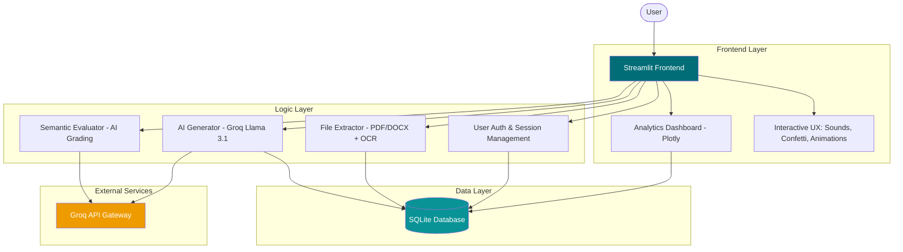

# 🧠 SmartQuizzer Pro


SmartQuizzer Pro is an advanced, AI-powered educational tool designed to transform static study materials into interactive learning experiences. By leveraging state-of-the-art LLMs (Large Language Models) via the Groq API, it generates high-quality quizzes from PDFs, DOCX files, or pasted text, providing real-time evaluation and deep performance analytics.

---

## 📑 Table of Contents

- [🚀 Key Features](#-key-features)
- [🏗️ System Architecture](#️-system-architecture)
- [🛠 Tech Stack](#-tech-stack)
- [▶️ Getting Started](#️-getting-started)
- [📖 Core Workflow](#-core-workflow)
- [📂 Project Structure](#-project-structure)
- [🗄 Backend & Data](#-backend--data)
- [📊 Future Roadmap](#-future-roadmap)
- [👥 Contributors](#-contributors)

---

## 🚀 Key Features

* 📄 **Intelligent Text Extraction**: Extracts text from PDFs and DOCX files. Includes **OCR (Optical Character Recognition)** support for extracting text from embedded images and graphics within PDFs.
* 🧠 **AI-Driven Question Generation**: Utilizes **Groq's Llama 3.1 8B/70B** models to generate contextually relevant questions (MCQ, True/False, and Short Answer).
* 📝 **Subjective AI Grading**: Short answers are evaluated semantically using AI, providing feedback based on the core meaning rather than simple keyword matching.
* 📊 **Gamified UX/UI**: Features a premium interface with:
    * **Single Question View**: Focus on one question at a time.
    * **Instant Feedback**: Sound effects and visual cues for correct/wrong answers.
    * **Animations**: Confetti bursts on completion and smooth transitions.
* 📈 **Advanced Analytics**:
    * **Accuracy Trends**: Track improvement over time.
    * **Difficulty Radar**: Visualize strengths and weaknesses across different difficulty levels.
    * **Activity Timeline**: Monitor engagement over days.
* 🔐 **Secure User System**: Full authentication suite with login, registration, and mobile number verification.

---

## 🏗️ System Architecture



---

## 🛠 Tech Stack

- **Frontend**: Streamlit (Python-based interactive UI)
- **AI Core**: Groq API (Llama 3.1 Models)
- **OCR Engine**: Tesseract OCR
- **Database**: SQLite (built-in storage for local development)
- **Data Visualization**: Plotly Express & Graph Objects
- **Styling**: Custom CSS (Glassmorphism & Fluid Design)

---

## ▶️ Getting Started

### 1. Requirements
Ensure you have Python 3.8+ and Tesseract OCR installed on your system.

### 2. Environment Setup
Create a `.env` file in the root directory and add your Groq API Key:
```env
GROQ_API_KEY=your_api_key_here
```

### 3. Install Dependencies
```bash
pip install -r requirements.txt
```

### 4. Run Application
```bash
streamlit run app.py
```

---

## 📖 Core Workflow

1. **Upload**: User provides a PDF/DOCX or pastes raw text.
2. **Process**: The system cleans the text and uses OCR if images are found.
3. **Configure**: User selects difficulty (Easy, Medium, Hard), question count, and type (MCQ, Short Answer, etc.).
4. **Generate**: Groq API generates a structured JSON quiz.
5. **Quiz**: User takes the quiz with interactive feedback.
6. **Analyze**: Performance is saved to SQLite and visualized in the dashboard.

---

## 📂 Project Structure

```text
TeamB_final_Project/
│
├── app.py                # Main application & Streamlit UI logic
├── analytics.py          # Dashboard rendering & visualization logic
├── db.py                 # MySQL helper (Optional/Production)
├── question_generator.py # Logic for prompt engineering & AI calls
├── quiz_engine.py        # Core scoring & attempt handling
├── questions.json        # Temporary question cache
│
├── utils/                # Utility modules
│   └── storage.py       # SQL database operations (SQLite)
│
├── data/                 # Database storage
│   └── smartquizzer.db  # Primary persistent storage
│
├── .env                  # Environment secrets (API Keys)
└── requirements.txt      # Project dependencies
```

---

## 🗄 Backend & Data

The system uses **SQLite** by default for seamless "zero-config" setup.
* **`users`**: Stores credentials, mobile numbers, and hashes.
* **`quizzes`**: Stores generated questions for re-attempting or review.
* **`attempts`**: Stores granular performance data, including difficulty-wise breakdown.

---

## 📊 Future Roadmap

- [ ] **Multi-User Collaboration**: Shared quiz rooms for classrooms.
- [ ] **Proctoring Features**: Browser-lock and time-limit settings.
- [ ] **Export Options**: Export quizzes to PDF or Google Forms format.
- [ ] **Flashcards**: Auto-generate flashcards from study materials.

---

## 👥 Contributors

- **Sujal Gupta** – Lead System Architect & Data Analytics
- **Shuchi Makhija** – AI Engineer (LLM Integration & OCR)
- **Shiva** – Backend Developer (Database & Scalability)
- **Lithika D** – UI Developer (UX Design & Animations)
