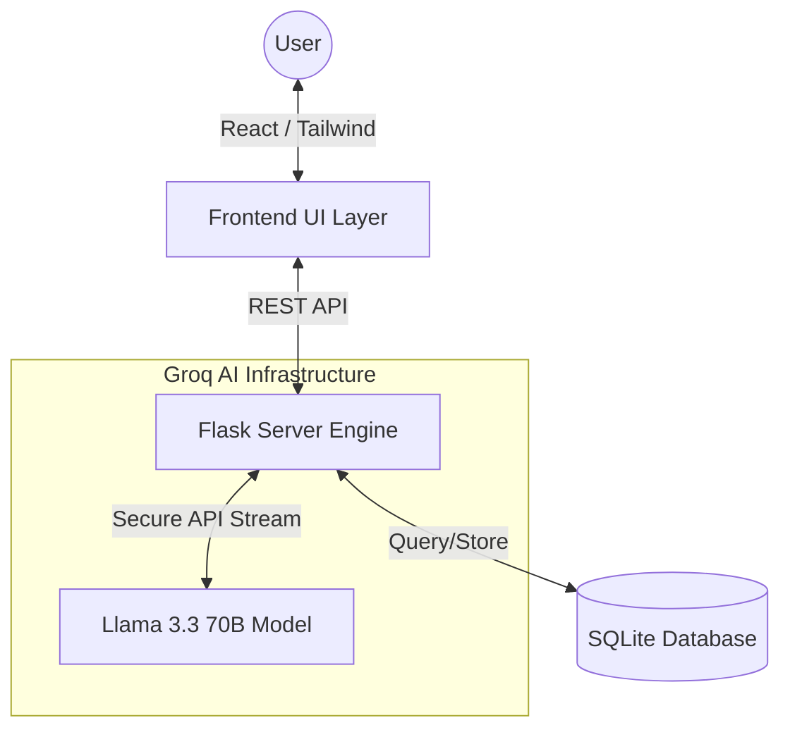
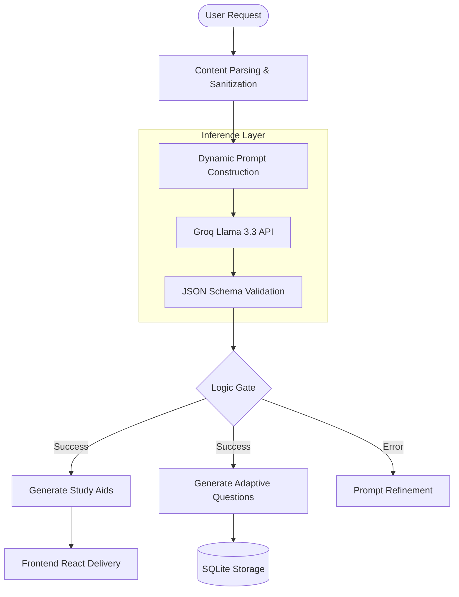

# 🧠 SmartQuizzer Live


SmartQuizzer Live is an AI-powered quiz generator built using **Python and Streamlit**. The application allows users to upload study materials (PDFs) and automatically extract text to generate interactive quizzes, complete with real-time analytics and tracking.

---

## 📑 Table of Contents

- [Features](#🚀-features)
- [Target Audience](#🎯-target-audience)
- [Tech Stack](#🛠-tech-stack)
- [Getting Started](#▶️-getting-started)
- [Usage](#📖-usage)
- [Project Structure](#📂-project-structure)
- [Backend Database](#🗄-backend-database)
- [GitHub Setup](#📦-github-setup)
- [Future Improvements](#📊-future-improvements)
- [Team Members & Contributions](#👥-team-members--contributions)

---

## 🚀 Features

* 📄 **PDF Text Extraction**: Generate quizzes seamlessly from uploaded study materials.
* 🧠 **AI-Based Generation**: Automated context-aware quiz generation.
* 📊 **Interactive Analytics Dashboard**: Beautiful charts and statistics to track performance over time.
* 🗂 **Automated Storage**: Backend SQLite database to manage history without manual setup.
* 📈 **Live Performance Tracking**: View dynamic, live updates on your quiz attempts.
* 🧪 **Attempt History**: Stores past quiz attempts, scores, and metadata for review.
* ✨ **Interactive Splash Screen**: Beautiful 2-second animated entrance for the application.
* ⚡ **Instant Quiz Viewing**: Automatically redirects to the quiz immediately after generation.
* 📑 **Single Question View**: Enhanced user experience by showing one question at a time.

---

## 🎯 Target Audience

- **Students**: Quickly generate practice quizzes from lecture notes and study materials to prepare for exams.
- **Educators & Teachers**: Effortlessly create assessment materials and interactive quizzes for students based on lesson plans.
- **Self-Learners & Professionals**: Test knowledge retention on manuals, academic papers, or any PDF document.

---

## 🛠 Tech Stack

- **Frontend / UI**: Streamlit
- **Backend Language**: Python
- **Database**: SQLite (built-in)
- **Data Visualization**: Matplotlib / Plotly
- **AI / Data Processing**: NLP Concepts

---

## 🏗 Architecture



---

## 🔄 Workflow



---

## ▶️ Getting Started

Follow these steps to run the application locally on your machine.

### 1. Clone the repository (if applicable)
```bash
git clone https://github.com/<your-username>/<your-repo>.git
cd <your-repo>
```

### 2. Install dependencies
Ensure you have Python installed, then install the required Python packages:
```bash
pip install -r requirements.txt
```

### 3. Run the application
Start the Streamlit server:
```bash
streamlit run app.py
```
*The application should now be accessible in your browser at `http://localhost:8501`.*

---

## 📖 Usage

1. **Upload Material**: Navigate to the upload section and provide your PDF notes.
2. **Generate Quiz**: Click the "Generate" button and let the app process the text into questions.
3. **Take the Quiz**: Answer the generated questions interactively and submit.
4. **View Analytics**: Head over to the Analytics Dashboard to see your score, historical performance, and insights.

---

## 📂 Project Structure

```text
SmartQuizzer/
│
├── app.py                   # Main Streamlit application entry point
├── text_extractor.py        # Logic for extracting text from uploaded PDFs
├── question_generator.py    # AI logic for generating quiz questions from text
├── quiz_engine.py           # Core logic for handling quiz sessions and scoring
├── analytics.py             # Analytics generation and dashboard visualizations
│
├── data/                    # Local data storage directory
│   ├── smartquizzer.db      # SQLite database for storing history
│   ├── questions.json       # Temporary/cached question storage
│   └── attempts.json        # Temporary/cached metadata for attempts
│
├── utils/                   # Utility modules
│   └── storage.py           # Database handling and file IO utilities
│
└── requirements.txt         # Project dependencies
```

---

## 🗄 Backend Database

The backend database is automatically instantiated on the first run. By default, it is created at:
```text
data/smartquizzer.db
```
It reliably stores:
* Generated quizzes and questions
* User attempts and timestamps
* Scores and performance metrics
* Raw analytics data

---

## 📦 GitHub Setup

**If you are pushing the project for the first time:**

```bash
git init
git add .
git commit -m "Initial commit ✨"
git branch -M main
git remote add origin https://github.com/<your-username>/<your-repo>.git
git push -u origin main
```

**If the repository already exists:**

```bash
git add .
git commit -m "Update README and refine structure"
git push
```

---

## 📊 Future Improvements

* 🤖 Integration with advanced LLMs (like OpenAI/Claude) for more nuanced question generation.
* ☁️ Online deployment with Streamlit Cloud or Heroku.

---

## 👥 Team Members & Contributions

This project was developed by a team of four members:

- **Sujal Gupta (Team Leader)** – Lead System Architect, Data Analytics
  - Led the project planning, task distribution, and overall execution
  - Designed system architecture and workflow
  - Worked on data processing, analytics, and module integration
  - Ensured smooth collaboration between AI, backend, and frontend teams

- **Shuchi Makhija** – AI Engineer
  - Developed AI/ML models for quiz generation
  - Implemented adaptive difficulty logic
  - Integrated NLP and LLM APIs

- **Shiva** – Backend Developer
  - Built APIs and backend services
  - Managed server-side logic and database communication
  - Handled system integration

- **Lithika D** – UI Developer
  - Designed and developed user interface
  - Improved user experience (UX)
  - Integrated frontend with backend

- **Santhosh S** – UI Developer
  - Designed and developed user interface
  - Improved user experience (UX)
  - Integrated frontend with backend